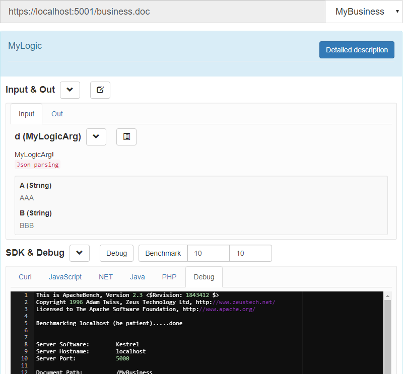

# Business.AspNet
This is the middleware library from Business.Core to ASP.NET

**Install**
[](https://www.nuget.org/packages/Business.AspNet/)
[](https://www.nuget.org/packages/Business.AspNet)
***
## Step 1: Create a new asp.net core web empty project and use Middleware in Startup.cs
```C#
using Business.AspNet;

public void ConfigureServices(IServiceCollection services)
{
    //Configure cross domain policy
    services.AddCors(options =>
    {
        options.AddPolicy("any", builder => builder.AllowAnyOrigin().AllowAnyMethod().AllowAnyHeader());
    });
    services.AddMvc(option => option.EnableEndpointRouting = false)
        .SetCompatibilityVersion(Microsoft.AspNetCore.Mvc.CompatibilityVersion.Latest);
}

public void Configure(IApplicationBuilder app, IWebHostEnvironment env)
{
    //app.UseBusiness();
	
    app.UseCors("any");//API static documents need cross domain support
	
    //If you want to configure documents
    app.UseBusiness(Business.Core.Bootstrap.CreateAll<BusinessBase>()
        .UseDoc(new Business.Core.Document.Config
        {
            Debug = true,
            Benchmark = true
        }));
}
```
## Step 2: Declare your business class, Create a new class and copy the following
```C#
using Business.Core;
using Business.Core.Annotations;
using Business.Core.Auth;
using Business.Core.Result;
using Business.AspNet;
using Microsoft.AspNetCore.Http;
using System.Threading.Tasks;
using System;

[TokenCheck]//This is your token verification
[Use]//Comments required for injection into parameters
[Logger(canWrite: false)]//Do not output log
public struct Token : IToken
{
    [System.Text.Json.Serialization.JsonPropertyName("K")]
    public string Key { get; set; }

    [System.Text.Json.Serialization.JsonPropertyName("R")]
    public string Remote { get; set; }

    [System.Text.Json.Serialization.JsonPropertyName("P")]
    public string Path { get; set; }

    [System.Text.Json.Serialization.JsonIgnore]
    public string Callback { get; set; }

    [System.Text.Json.Serialization.JsonIgnore]
    public Business.AspNet.Token.OriginValue Origin { get; set; }
}

//This is your token verification, must be inherited ArgumentAttribute
public class TokenCheck : ArgumentAttribute
{
    //Good state specifications are important
    public TokenCheck(int state = -80, string message = null) : base(state, message) { }

    public override async ValueTask<IResult> Proces(dynamic value)
    {
        var key = value.Key as string;

        //..1: check token key
        if (string.IsNullOrWhiteSpace(key))
        {
            //return this.ResultCreate(this.State, this.Message);
        }
        return this.ResultCreate(); //ok
    }
}

/// <summary>
/// MyLogicArg!
/// </summary>
public struct MyLogicArg
{
    /// <summary>
    /// AAA
    /// </summary>
    public string A { get; set; }
    /// <summary>
    /// BBB
    /// </summary>
    public string B { get; set; }
}

//Maybe you need a custom base class? To unify the processing of logs and token
public class MyBusiness : Business.AspNet.BusinessBase
{
    public MyBusiness()
    {
        this.Logger = new Logger(async (Logger.LoggerData log) =>
        {
            //Output log
            Console.WriteLine(log.ToString());
        });
    }
	
    //Override, using custom token In order to be able to process token data
    public sealed override async ValueTask<IToken> GetToken(HttpContext context, Business.AspNet.Token token) 
       => new Token
    {
        Origin = token.Origin,
        Key = token.Key,
        Remote = token.Remote,
        Callback = token.Callback,
        Path = token.Path
    };
	
    //My first business logic
    //Logical method must be public virtual!
    //If you customize the base class, you just need to concentrate on writing logical methods!
    public virtual async Task<IResult<MyLogicArg>> MyLogic(Token token, MyLogicArg arg)
    {
        return this.ResultCreate(arg);
    }
}
```
## Step 3: Start the project in a self hosted way and navigate to http://localhost:5000/doc/index.html

It only needs 2 steps, less than 100 lines of code. With the minimum configuration, you can get the whole framework without any other operations!

Now, you can use HTTP and WebSocket to call the same interface, and have a document that can be debugged.   
**Try clicking the Debug button on the document?**

Why is there no comment on the document?  
**In project properties -> generate -> select XML document file**

## You want to control WebSocket?
There are three ways of rewriting to help you

a: **[WebSocketAccept]** is accepting a WebSocket connection. You can return null to refuse to disconnect the connection
   If you return any string, it will represent the token of the client. It's better to get this credential from request.headers

b: **[WebSocketReceive]** is receiving a packet from a WebSocket connection and returning an object that implements ireceivedata
    You can try to parse or return the base class by yourself

c: **[WebSocketDispose]** is disconnecting a WebSocket connection to facilitate your own connection management, or do nothing?

## About the communication layer
The following three communication layer objects will be injected into your logical methods as parameters

a: **[Business.AspNet.Context]** Current controller, valid only for HTTP communication

b: **[Business.Core.Annotations.HttpFile]** The file object currently requested to be uploaded, valid only for HTTP communication.  
Valid when this parameter is named "httpFile"

c: **[System.Net.WebSockets.WebSocket]** Current websocket object, Valid only for websocket communication

**In addition to parameter injection, there is a static object that you can use [Business.AspNet.Utils.Environment]**  
[Environment.AppSettings] An object of the appsettings.json configuration file [Appsettings] node  
[Environment.HttpClientFactory] An HTTP factory, convenient for you to communicate with the outside world

## About logger
Register log callback in business class constructor  

**single**
```C#
this.Logger = new Logger(async (Logger.LoggerData log) =>
{
    Console.WriteLine(log.ToString());
});
```
**batch**  
In the production environment, batch logging can reduce the occupation of thread pool and the request to log server  
```C#
this.Logger = new Logger(async (IEnumerable<Logger.LoggerData> log) =>
{
    foreach (var item in log)
    {
        Console.WriteLine(log.ToString());
    }
}
, new Logger.BatchOptions
{
    Interval = TimeSpan.FromSeconds(6), //Return the accumulated log within 6 seconds
    MaxNumber = 2000 //It also returns when 2000 logs are accumulated
});
```

## Do you think it's over? Did not!
~~You also need to understand call wrapping and return wrapping~~



***
To learn more about him, refer to the https://github.com/xlievo/Business.AspNet/tree/master/WebAPI use case

ASP.NET just acts as the communication layer. 
If you know Business.Core well, you can replace it with any communication layer you need, Include calls from class libraries

*If you have any questions, you can email me xlievo@live.com and I will try my best to answer them*
